# OS复习

**目录**：

- [OS复习](#os--)
  * [Chap3-进程描述与控制](#chap3--------)
    + [进程（经典模型](#-------)
      - [多道程序系统](#------)
        * [多道程序批处理系统](#---------)
        * [分时系统](#----)
        * [实时事务处理系统](#--------)
      - [进程的定义](#-----)
      - [进程眼中的机器抽象](#---------)
        * [进程与操作系统抽象的机器的交互](#---------------)
    + [进程状态](#----)
      - [进程何时创建](#------)
      - [进程何时终止](#------)
      - [进程状态模型](#------)
        * [引入五状态模型](#-------)
        * [等待队列模型](#------)
          + [多Blocked队列](#-blocked--)
          + [多Ready队列](#-ready--)
        * [挂起suspended](#--suspended)
          + [挂起原因](#----)
    + [进程描述](#----)
      - [Process Table](#process-table)
        * [进程table中PCB的组织方式](#--table-pcb-----)
      - [进程映像](#----)
      - [Process Control Block](#process-control-block)
        * [(1)进程标志信息](#-1-------)
        * [(2)进程状态信息](#-2-------)
        * [(3)进程控制信息](#-3-------)
    + [进程控制](#----)
      - [执行模式](#----)
        * [两者区别](#----)
        * [用途](#--)
        * [要求](#--)
      - [进程创建过程](#------)
      - [进程切换](#----)
        * [进程切换的发生](#-------)
        * [mode切换过程](#mode----)
        * [进程切换过程](#------)
  * [Chap4-线程](#chap4---)
    + [线程的引入](#-----)
    + [线程的定义](#-----)
    + [多线程程序的优点](#--------)
      - [自身优点](#----)
      - [与进程比较](#-----)
    + [多线程（概述）](#-------)
      - [进程与线程占有的资源对比](#------------)
      - [线程的栈](#----)
      - [线程的sched和dispatch](#---sched-dispatch)
      - [线程功能](#----)
      - [线程状态](#----)
      - [线程同步](#----)
    + [多线程模型](#-----)
      - [用户态线程(User-Level Threads)](#------user-level-threads-)
        * [线程状态与进程状态](#---------)
        * [ULT的优点](#ult---)
        * [ULT的缺点](#ult---)
          + [Blocking系统调用的解决——Jacketing](#blocking---------jacketing)
      - [内核态线程(Kernel-Level Threads)](#------kernel-level-threads-)
        * [KLT的优点](#klt---)
        * [KLT缺点](#klt--)
      - [ULT和KLT的联系](#ult-klt---)
    + [线程问题](#----)
      - [fork()系统调用](#fork------)
      - [线程取消](#----)
      - [线程池](#---)
      - [线程调度](#----)
        * [Many-to-Many模型](#many-to-many--)
        * [Upcall——用户线程库与内核的通信](#upcall-------------)
          + [Upcall响应过程](#upcall----)
  * [Chap5-并发控制（同步互斥）](#chap5-----------)
    + [临界资源](#----)
    + [互斥-软件方法](#-------)
      - [Dekker算法](#dekker--)
        * [严格的切换](#-----)
        * [第二种方式](#-----)
        * [第二种改进](#-----)
        * [第三种方式](#-----)
        * [第四种方式](#-----)
        * [改进](#--)
      - [Peterson算法](#peterson--)
    + [互斥-硬件方法](#-------)
      - [关中断](#---)
      - [Test and Set自旋锁](#test-and-set---)
    + [互斥-信号量](#------)
      - [生产者消费者问题](#--------)
      - [信号量的实现](#------)
      - [理发店问题](#-----)
    + [管程](#--)
  * [Chap6-死锁](#chap6---)
    + [联合进程图](#-----)
    + [死锁的必要非充分条件](#----------)
    + [循环等待：资源分配图](#----------)
    + [四种死锁处理策略](#--------)
    + [死锁预防](#----)
      - [(1)避免互斥](#-1-----)
      - [(2)避免“占有并等待”](#-2----------)
        * [缺点](#--)
      - [(3)支持抢占](#-3-----)
      - [(4)避免循环等待](#-4-------)
    + [死锁避免](#----)
      - [进程启动拒绝](#------)
      - [资源分配拒绝——*银行家算法*](#---------------)
        * [系统状态](#----)
        * [safe与unsafe状态](#safe-unsafe--)
        * [判断安全与不安全状态](#----------)
      - [银行家算法](#-----)
        * [优点](#--)
        * [缺点](#---1)
    + [死锁检测与恢复](#-------)
      - [死锁检测算法](#------)
      - [死锁恢复算法](#------)
        * [终止/抢占进程选择策略](#-----------)
    + [Ostrich算法](#ostrich--)
    + [哲学家就餐问题](#-------)
  * [Chap9-单处理器调度](#chap9-------)
    + [短程调度](#----)
      - [分类-抢占/非抢占](#---------)
        * [非抢占式](#----)
        * [抢占式](#---)
      - [调度算法的目标](#-------)
        * [对所有OS](#---os)
        * [对批处理系统](#------)
        * [交互系统](#----)
        * [实时系统](#----)
        * [User-Oriented v.s System-Oriented](#user-oriented-vs-system-oriented)
      - [先来先服务(FCFS/FIFO)策略](#------fcfs-fifo---)
        * [调度过程](#----)
        * [周转时间](#----)
        * [FCFS优缺点](#fcfs---)
      - [Round-Robin轮转调度](#round-robin----)
        * [调度过程](#-----1)
        * [分析](#--)
        * [改进：Virtual round robin(VRR)](#---virtual-round-robin-vrr-)
      - [Shortest Process Next最短运行时间](#shortest-process-next------)
        * [分析](#---1)
      - [Shortest Remaining Time最短剩余时间](#shortest-remaining-time------)
      - [优先级调度](#-----)
        * [过程](#--)
        * [优先级](#---)
        * [抢占性](#---)
      - [Highest Response Ratio Next最高响应比(HRRN)](#highest-response-ratio-next------hrrn-)
        * [分析](#---2)
      - [Multilevel Queue Scheduling多层队列调度](#multilevel-queue-scheduling------)
      - [Feedback反馈（多级反馈）](#feedback--------)
        * [流程](#--)
        * [分析](#---3)
        * [改进](#---1)
  * [Chap7-内存管理](#chap7-----)
    + [连续内存分配](#------)
      - [内存分区](#----)
        * [固定分区](#----)
          + [放置策略](#----)
          + [优缺点](#---)
        * [动态分区](#----)
          + [Compaction](#compaction)
          + [分配算法](#----)
        * [缺点](#---2)
      - [Buddy System伙伴系统](#buddy-system----)
    + [分页](#--)
      - [页表与逻辑地址](#-------)
      - [分页与分区](#-----)
    + [分段](#--)
      - [分段和动态分区](#-------)
      - [分段和分页](#-----)
  * [Chap8-虚拟内存](#chap8-----)
    + [硬件和控制结构](#-------)
      - [Paging](#paging)
        * [Page Table Entry](#page-table-entry)
          + [控制位](#---)
        * [Page Table Structure](#page-table-structure)
          + [问题：](#---)
        * [Two-Level Page Table](#two-level-page-table)
          + [解决的问题](#-----)
          + [结构](#--)
          + [问题](#--)
        * [Inverted Page Table](#inverted-page-table)
        * [Translation Lookaside Buffer](#translation-lookaside-buffer)
          + [解决的问题](#------1)
          + [设计](#--)
          + [TLB进程切换](#tlb----)
        * [页大小的设计](#------)
          + [相关问题](#----)
      - [Segmentation](#segmentation)
        * [优点](#---1)
    + [OS Software](#os-software)
      - [Fetch Policy](#fetch-policy)
      - [Placement Policy](#placement-policy)
        * [NUMA Multiprocessor](#numa-multiprocessor)
      - [Replacement Policy](#replacement-policy)
        * [Optimal Policy](#optimal-policy)
        * [Least Recently Use(LRU)](#least-recently-use-lru-)
          + [链表实现](#----)
          + [Counter实现](#counter--)
          + [Matrix矩阵实现](#matrix----)
        * [First-In-First-Out](#first-in-first-out)
        * [Belady's Anomaly异态](#belady-s-anomaly--)
          + [Stack Algorithms](#stack-algorithms)
      - [额外状态位](#-----)
        * [Second Chance Algorithm](#second-chance-algorithm)
        * [Clock Policy](#clock-policy)
          + [与FIFO](#-fifo)
        * [Clock Policy改进](#clock-policy--)
          + [算法步骤](#----)
          + [优点](#---2)
        * [其他基于count的策略](#----count---)
        * [Page Buffering](#page-buffering)
          + [过程](#---1)
          + [优点](#---3)
      - [Resident Set Management驻留集管理](#resident-set-management-----)
        * [三大要点](#----)
        * [分配策略](#----)
      - [Working Set Strategy工作集策略](#working-set-strategy-----)
        * [定义](#--)
        * [Page Fault Frequency Algorithm缺页频率PFF](#page-fault-frequency-algorithm----pff)
          + [PFF的意义](#pff---)
          + [算法步骤](#-----1)
          + [缺点](#---3)
        * [Variable-Interval Sampled Working Set采样间隔可变工作集(VSWS)](#variable-interval-sampled-working-set----------vsws-)
          + [算法步骤](#-----2)
          + [效果](#--)
        * [Cleaning Policy清除策略](#cleaning-policy----)
          + [使用Page Buffering](#--page-buffering)
        * [Load Control负载控制](#load-control----)
          + [Thrashing（抖动/颠簸）](#thrashing-------)
  * [Chap11-I/O管理和磁盘调度](#chap11-i-o-------)
    + [I/O类别](#i-o--)
      - [Programmed I/O](#programmed-i-o)
      - [Interrupt-Driven I/O](#interrupt-driven-i-o)
      - [I/O Using DMA](#i-o-using-dma)
    + [I/O软件架构](#i-o----)
      - [Interrupt Handlers](#interrupt-handlers)
      - [Device Driver](#device-driver)
        * [驱动的工作流程](#-------)
      - [Device-Independent I/O Software](#device-independent-i-o-software)
        * [I/O保护](#i-o--)
      - [User-Space I/O Software](#user-space-i-o-software)
    + [I/O Buffering](#i-o-buffering)
      - [单缓冲区](#----)
      - [双缓冲区](#----)
      - [循环缓冲区](#-----)
      - [Buffering：总结](#buffering---)
        * [Buffer和Cache](#buffer-cache)
    + [磁盘](#--)
      - [性能参数](#----)
      - [磁盘调度](#----)
        * [FIFO](#fifo)
        * [Priority](#priority)
        * [Shortest Service Time First](#shortest-service-time-first)
        * [SCAN](#scan)
        * [C-SCAN(circular scan)](#c-scan-circular-scan-)
        * [N-Step-SCAN](#n-step-scan)
        * [FSCAN](#fscan)
  * [Chap12-文件系统](#chap12-----)
    + [文件目录](#----)
      - [文件目录结构](#------)
        * [Single-Level Directory](#single-level-directory)
        * [Two-Livel Directory](#two-livel-directory)
        * [Tree-Structured Directory](#tree-structured-directory)
          + [Path Name](#path-name)
        * [Acyclic-Graph Directory无环图目录](#acyclic-graph-directory-----)
          + [文件共享](#----)
        * [硬链接](#---)
        * [符号链接](#----)
    + [文件保护](#----)
      - [访问控制](#----)
        * [域](#-)
          + [Access Control List存取控制列表](#access-control-list------)
          + [Capability权能](#capability--)
    + [组块记录](#----)
      - [Fixed Blocking](#fixed-blocking)
      - [Variable Blocking: Spanned](#variable-blocking--spanned)
      - [Variable Blocking: Unspanned](#variable-blocking--unspanned)
    + [二级存储管理](#------)
      - [File Allocation](#file-allocation)
        * [Contiguous Allocation](#contiguous-allocation)
          + [优缺点](#----1)
        * [Chained Allocation](#chained-allocation)
        * [FAT: File Allocation Table](#fat--file-allocation-table)
        * [FAT: Indexed](#fat--indexed)
    + [UNIX文件系统](#unix----)

<small><i><a href='http://ecotrust-canada.github.io/markdown-toc/'>Table of contents generated with markdown-toc</a></i></small>


## Chap3-进程描述与控制

### 进程（经典模型

* 支持并发操作
* 让单CPU虚拟成多CPU（同时运行多个进程

#### 多道程序系统

* 多道程序批处理系统
* 分时系统
* 实时事务处理系统

##### 多道程序批处理系统

目的：保持处理器与I/O工作，最大化效率

##### 分时系统

* 响应单个用户需求
* 支持多用户同时使用

##### 实时事务处理系统

* 一些用户同时向database发起query或update
* 与分时系统区别：支持更多应用
* 与分时系统相同：系统响应时间是首要的

#### 进程的定义

* 一个在执行的程序
* 运行程序的实例
* 可以被分配，运行的实体
* 一系列活动，一个状态，一些系统资源
* **特点**：动态性，并发性，独立性，异步性

#### 进程眼中的机器抽象

**进程以为自己有独立的主存和CPU资源**！

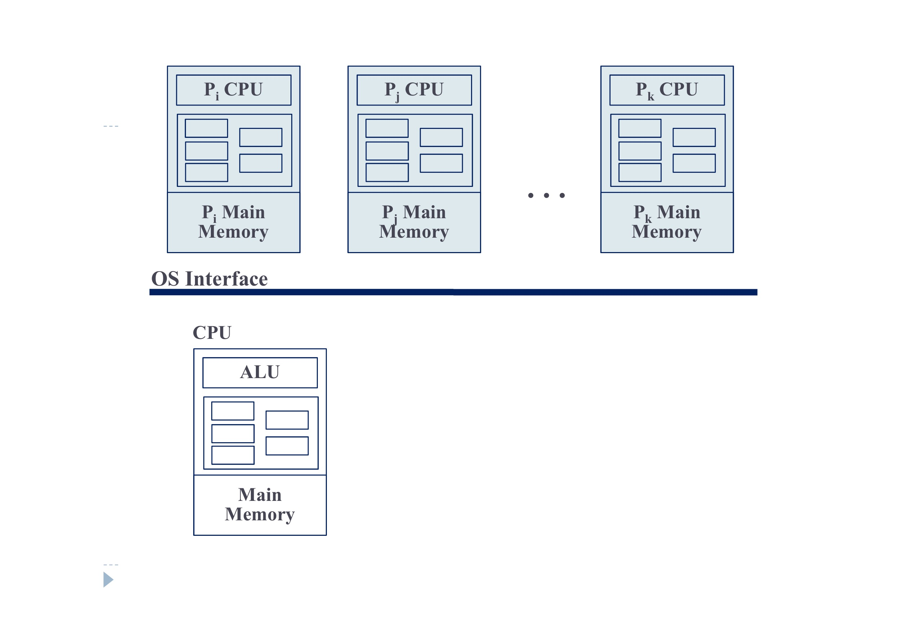

##### 进程与操作系统抽象的机器的交互

* OS的系统调用
* 用户级指令
* trap指令（陷入内核

### 进程状态

#### 进程何时创建

* 批处理作业初始化
* 用户log on或请求创建
* OS创建（提供服务）
* 一个进程请求创建另一个

#### 进程何时终止

* 批处理作业：显式调用`exit()`告知系统完成
  * 正常完成
* 用户退出（交互程序）
* 错误发生时
  * 访问越界
  * 超过时限
  * 特权指令
* 被父进程终止
  * 父进程自己被终止

#### 进程状态模型

**两阶段模型的问题**：

* 只有一个等待队列
* 细化不在运行的状态

##### 引入五状态模型

* New
  * OS完成辅助工作（进程标志，进程管理table）
  * 限制系统进程数
  * 进程可能还不在主存
* Exit：
  * 进程管理table和其他相关信息由OS暂存
  * 辅助程序可以收集信息

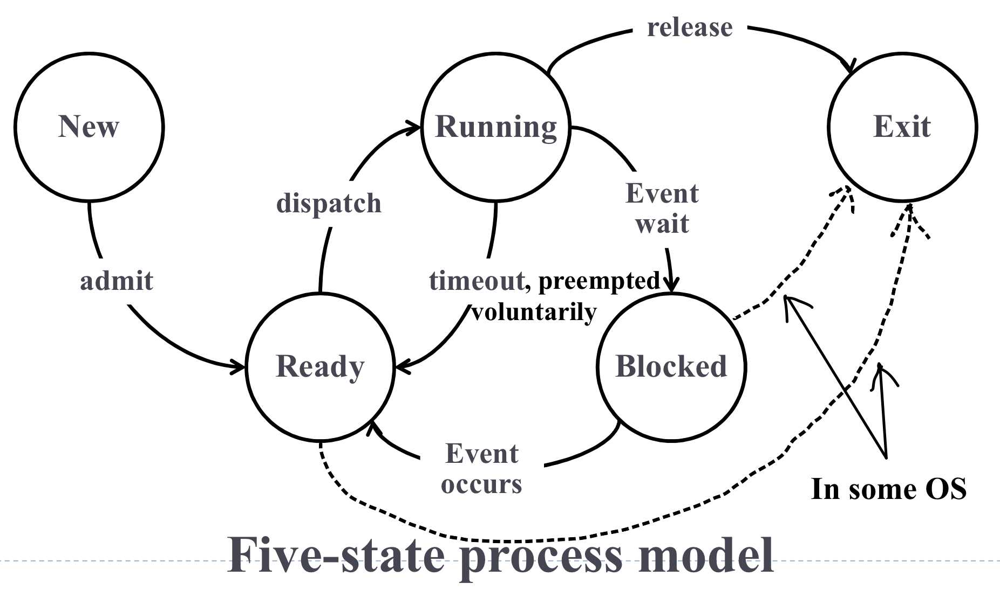

（部分系统中，Ready和Blocked的进程也能被直接终止进入exit状态）

##### 等待队列模型

###### 多Blocked队列

**单Blocked队列的问题**：

* 事件发生时，OS需要扫描整个队列查看在等待这个事件的进程
* 进程多时效率低下

**因此，每个事件都有一个阻塞队列**！

###### 多Ready队列

* 不同优先级有各自的就绪队列

##### 挂起suspended

* 等待IO等的进程如果被交换到disk，就变为挂起态
* 问题：被挂起的进程都是blocked，换入他们没好处
* 被挂起的可能是ready的，也可能是blocked的
  
###### 挂起原因

* 交换：为了腾出主存空间
* 其他OS原因：挂起可能导致问题出现的进程
* 用户请求:debug
* 定时：一个只需要定时运行的进程
* 父进程请求：挂起子进程来修改或协调多个子进程

### 进程描述

#### Process Table

OS维护一个进程table，其中的表项为PCB

##### 进程table中PCB的组织方式

1. 链表链接：同一状态的PCB连成链表，形成就绪队列，阻塞队列等
2. 索引方式：根据进程状态创建几张索引表

#### 进程映像

* 程序本身
* 堆栈
* 数据的存储位置

#### Process Control Block

存储进程位置，进程的属性（例如PID，状态等），主要存储三类信息

##### (1)进程标志信息

* PID进程标识号
  * 每个进程唯一
  * 其他表会使用PID引用进程table
  * 在进程通信中起标志作用
  * 标识父/子关系
* UID用户标识号
  * 标识对这个job负责的用户

##### (2)进程状态信息

* 进程寄存器信息
  * 运行时保存在真正的寄存器中
  * 中断时被保存
* 寄存器一般包括：
  * 用户可见寄存器：通用寄存器等
  * 控制/状态寄存器：PC，EFlags
  * 栈寄存器：ESP，EBP

##### (3)进程控制信息

* schedule和state信息
  * 进程状态：running, ready, blocked
  * 优先级：调度优先级
  * 调度信息：与调度算法有关（例如已等待时间，运行时间
  * 事件：进程在等待的事件
* 数据结构
  * 等待队列
  * 父子关系树
* IPC（进程通信）
  * 相关的标志，信号，信息
* 内存管理信息：页表，段指针等
* 资源占有情况：如打开的文件
* 记账信息：（调度器可能需要）历史CPU占用情况等

### 进程控制

#### 执行模式

* 用户模式：低权限
* 内核模式：权限最高的

##### 两者区别

* 部分指令只有内核态能执行
  * 读，修改状态寄存器
  * I/O指令
  * 内存管理相关指令
* 部分内存区域只有内核能访问

##### 用途

* 保护操作系统不被用户程序修改
* 防止未授权访问

##### 要求

* CPU自己要能从用户模式进入内核模式
* 内核模式只应该运行OS代码
* 用户进行系统调用时要进入内核模式

#### 进程创建过程

1. 分配独一无二的PID
2. 分配内存空间
   * 代码，数据，栈
   * 设置共享地址空间
   * 分配PCB空间
3. 初始化PCB
4. 设置合适的连接（如将进程加入调度队列
5. 创建其他数据结构（如维护accounting文件记录性能分析

#### 进程切换

##### 进程切换的发生

* OS获得控制权
  * interrupt发生（外部与程序无关的
    * 时钟中断
    * I/O中断
    * 内存错误（缺页
  * trap发生（程序自己的错误
    * fatal：直接将程序进入exit状态
    * not fatal：处理
  * 系统调用

##### mode切换过程

1. 保存进程上下文
2. 设置PC寄存器指向中断处理程序
3. 切换到内核态

**中断不一定导致进程切换**！

##### 进程切换过程

1. 保存处理器上下文
2. 更新当前运行进程的PCB信息
3. 将PCB移到合适的等待队列（就绪，阻塞
4. 选择另一个要执行的进程
5. 更新选择的进程的PCB信息
6. 更新内存管理数据结构
7. 恢复被选中的进程的上下文

## Chap4-线程

### 线程的引入

**进程的两个特点**：

* 资源的占有
* 调度/执行

**线程与进程**：

* dispatch的对象是thread
* 资源的占有者是process

### 线程的定义

* CPU利用的基本单位
  * 线程号
  * Program Counter
  * 寄存器集合
  * 一个栈
* 和其他同进程的线程共享：
  * 数据段
  * 代码段
  * 其他系统资源（如打开的文件

### 多线程程序的优点

#### 自身优点

* 响应快
  * 程序可以用一个线程与用户交互，另一个线程在执行其他操作
* 资源共享
  * 进程的资源可以在线程间共享
* 经济性
  * 线程的创建切换消耗资源更少
* 多处理器架构的规模化应用
  * 多线程可以在多处理器上并行运行

#### 与进程比较

* 创建/结束/切换耗时都更少
* 共享内存，因此不用召唤内核就能互相通信
* 让应用运行更快（与多进程相同

### 多线程（概述）

* 支持单个程序中有多个线程
* 进程是资源获取和隔离保护的单位
  
#### 进程与线程占有的资源对比

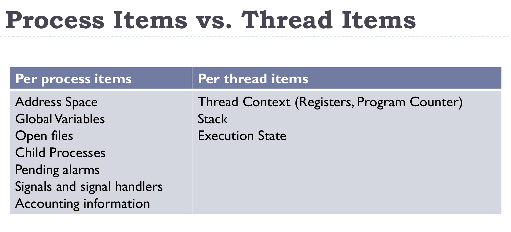
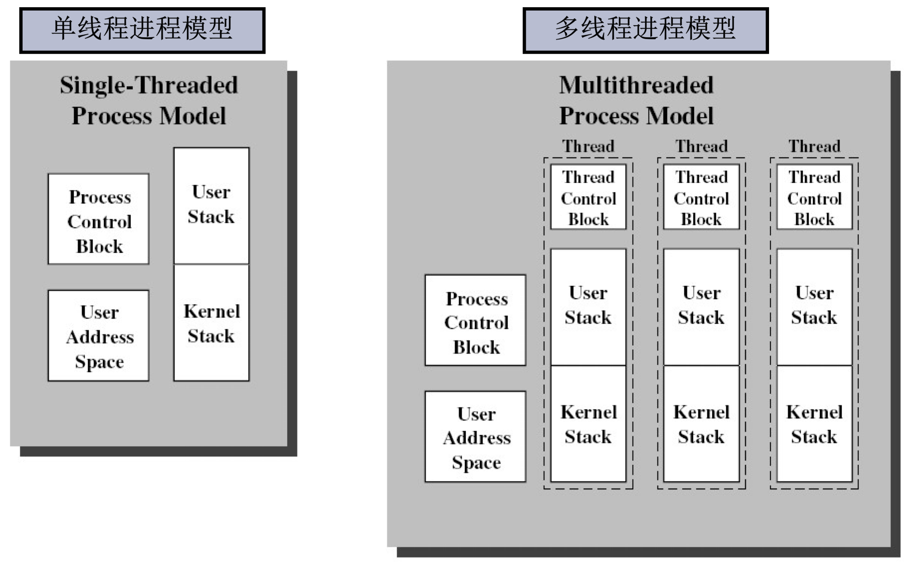

#### 线程的栈

* 保存过程调用帧
* 帧中含有过程的局部变量和返回地址
* 线程可能调用不同过程

#### 线程的sched和dispatch

* 调度和分发在线程基础上完成：大多数运行状态信息在线程数据结构中有保存
* 一些行为影响同进程的所有线程（在进程尺度上完成
  * 挂起（内存空间被换出主存
  * 进程终止

#### 线程功能

#### 线程状态

* states：Running，Ready，Blocked
* 状态改变相关操作：
  * Spawn
  * Block
  * Unblock
  * Finish

#### 线程同步

* 共享进程的地址空间与其他资源
* 不能让他们互相干扰

### 多线程模型

#### 用户态线程(User-Level Threads)

* 完全用户态线程：
  * 所有ULT管理都由应用自己完成
  * 操作系统不知道线程存在
* 线程库：
  * 线程创建和销毁
  * 线程间通信
  * 线程调度
  * 线程上下文save and restore
* 每个进程有自己的线程table
* 追踪线程所有状态

##### 线程状态与进程状态

* 线程2调用一个blocking系统调用：进程被block
* 线程2运行到时间了：进程变为ready
* 线程2请求线程1的运行结果：线程库block线程2，运行线程1

##### ULT的优点

* 线程切换不需要进入内核态进行context switch
* 不同应用可以有不同线程调度
* 可以在任何OS运行

##### ULT的缺点

* 线程系统调用导致被阻塞会使整个进程被阻塞
* 页错误问题：一个线程页错误，其他线程可能还能运行
* 不能利用到CPU多核心的多进程：每次只能运行自己的一个线程

###### Blocking系统调用的解决——Jacketing

* 将阻塞系统调用转为不阻塞的
* 线程调用Jacket而非直接调用系统I/O调用
* Jacket检查I/O是否在被使用
  * 如果是则让这个线程进入Ready状态，调度另一个线程
  * 这个线程重新获得控制时再次检查I/O状态

#### 内核态线程(Kernel-Level Threads)

* 完全内核态线程：所有线程管理由内核完成
* 内核维护进程线程的上下文（进程自己不维护线程表
* 调度在线程尺度上完成

##### KLT的优点

* 在多处理器上同时运行一个进程的多线程
* 一个线程阻塞可以调度同进程的其他线程
* 内核自己可以是多线程的

##### KLT缺点

* 所有可能阻塞线程的调用都以SysCall形式实现
  * 相比ULT，开销高
* 线程间控制权切换需要先有**mode switch**进kernel

#### ULT和KLT的联系

* Many-to-One：多个ULT映射一个kernel线程
* One-to-One：一个用户线程对应一个内核线程
* Many-to-Many：许多ULT对应更少或相同数量KLT

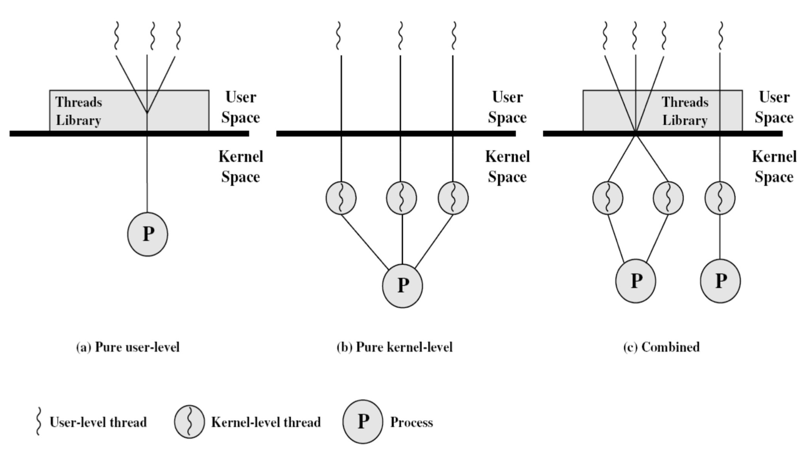

### 线程问题

#### fork()系统调用

1. 新的进程复制所有线程
2. 新的进程只复制调用`fork()`的线程

取决于`exec()`是否马上在fork后被调用

#### 线程取消

* 在线程执行完前cancel线程
* 两种方式：
  * 异步终止：另一个线程立即终止目标线程
  * 推迟终止：目标线程自己检查自己是否要终止

#### 线程池

* 响应请求时比新创建线程更快
* 限制线程总数

#### 线程调度

##### Many-to-Many模型

* 在用户和内核线程间设置中介数据结构（Lightweight Process)
* 对用户线程库，LWP是虚拟的处理器，应用调度线程在这些虚拟处理器运行
* 每个LWP对应一个内核线程，内核调度这些内核线程在真正的物理处理器运行
* LWP数量取决于应用
  * 单处理器系统上一个LWP对计算密集型应用足够
  * I/O密集型应用需要多个LWP

##### Upcall——用户线程库与内核的通信

* 内核提供一个有一些LWP的应用
* 应用在LWP上调度用户线程
* 内核通过Upcall机制告知应用一些event（线程库处理upcall

###### Upcall响应过程

1. 当一个应用线程可能要阻塞时，一个引起upcall的event发生，内核发起upcall通知应用
2. 内核给应用分配新的虚拟处理器，让应用运行upcall handler
3. upcall handler保存blocking线程状态，释放它的虚拟处理器
4. upcall handler调度另一个可运行线程
5. 当thread等待的event发生，内核用upcall通知线程库可以运行那个blocking thread

## Chap5-并发控制（同步互斥）

进程间关系：

1. 竞争（互相意识不到对方存在）
2. 通过共享方式合作
3. 通过通信方式合作

### 临界资源

可共享资源：同时被多进程访问
不可共享/临界资源：只能被一个进程同时访问

### 互斥-软件方法

不同进程对主存中同一位置的同时访问被一个控制程序串行化

#### Dekker算法

##### 严格的切换

* 使用一个全局变量turn标志当前能访问临界区的进程
* 进程需要忙等
* 一个进程的fail会导致其他进程被lock

##### 第二种方式

* 进程可以查看其他进程的状态
* 只要临界区没人就进入
* 不保证互斥（可能同时进入

##### 第二种改进

* 查看share lock状态，是0则改为1
* 仍然不保证互斥

##### 第三种方式

* 先设置自己的状态位（代表进入临界区），再检查其他进程状态
* 如果有其他进程在临界区，那就等待其他进程
* 可能有死锁（两个进程都设了状态位互相等）

##### 第四种方式

* 先设状态位，但也可以回退
* 如果有其他进程在临界区，reset状态位再设置
* 没有死锁，但有livelock（有成功执行的sequence

##### 改进

* 为了避免第四种方法大家都不进入临界区
* 使用方法一的全局变量turn
* 先设状态位，再获取turn

#### Peterson算法

* 相比Dekker更简单，更优雅的互斥算法
* 在临界区的进程会阻止其他进程进入
* 使用turn

### 互斥-硬件方法

允许/禁止中断
机器指令：

1. Test and Set
2. Exchange

#### 关中断

对单处理器系统：

* 并发进程只能被interleave，不能被overlap
* 一个进程会一直运行到中断为止
* 保证互斥

不适合多处理器系统：单个处理器上关中断没有用
给用户进程拒绝中断的权限不安全
对操作系统自己来说有用

#### Test and Set自旋锁

TSL RX, lock

* 将lock的内容读到RX
* 保证读和存的操作不会被打断
* 有忙等，有starvartion
* 死锁？优先级倒置

### 互斥-信号量

* 等待信号量会被挂起
* wait和signal不能被打断
* 引入等待队列

信号量只有3个操作：wait, signal, initialize

强信号量：等的最久的进程先被释放
弱信号量：不指定释放顺序

#### 生产者消费者问题

* 多个生产者，一个缓冲区
* 一个消费者
* 缓冲区是临界资源

#### 信号量的实现

保证信号量wait和signal操作的原子性：不被打断

1. 本身通过软硬件方法实现
2. 关中断-在单处理器系统比较适合
3. testset指令-多处理器系统

#### 理发店问题

* 3个理发位置
* 3个理发师
* 一个沙发
* 一个收银台
* 理发店内最多20个人

理发店的公平问题

### 管程

## Chap6-死锁

### 联合进程图

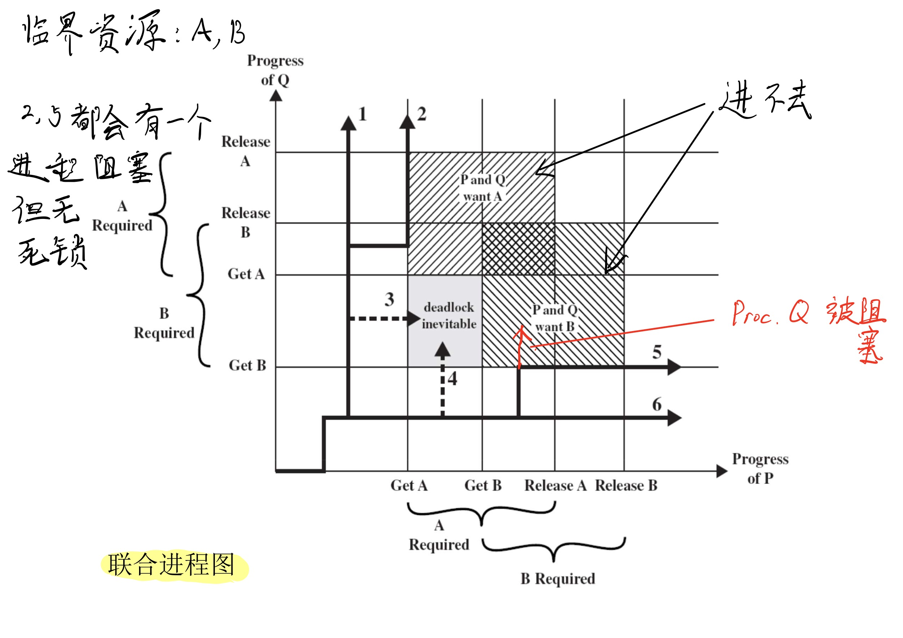

### 死锁的必要非充分条件

1. 资源是互斥的（临界资源）
2. 进程等待其他资源时会占有现有资源
3. “非抢占”-资源不能被从一个进程那儿抢走
4. 有进程对资源的循环等待

### 循环等待：资源分配图

* 节点是 进程 和 资源
* 边是 进程->资源的请求 和 资源->进程的分配
* 如果图中有环：
  * 每种资源只时有一个：死锁已经发生
  * 每种资源有多个：死锁可能发生

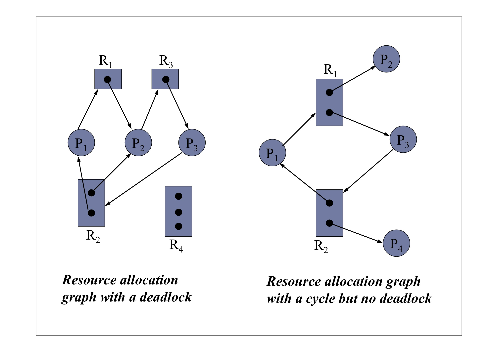

### 四种死锁处理策略

* Ostrich算法：不处理（被大多数OS采用，并发度高
* 检测并恢复：让死锁发生，检测，并解决
* 动态避免：谨慎地进行资源分配
* 死锁预防：避免四种死锁条件

### 死锁预防

* 目的是使得系统中不会发生死锁
* 通过**限制对资源的请求**(限制进程行为)避免死锁，保证四个必要条件不同时满足

#### (1)避免互斥

不可能，因为很多时候互斥是必须的

#### (2)避免“占有并等待”

* 需要保证进程请求新的资源时，不能占有其他资源
* 方式：只在进程执行前一次性分配所有需要资源
* 另一个方法：只允许没资源时申请

##### 缺点

1. 效率低，要等很久且不能在进程开始前准确知道所有资源需求
2. 可能有starvation

#### (3)支持抢占

* 方式：如果一个进程的资源申请被拒，就释放它的所有资源
* 另一个方式：进程申请被占用的资源时查看占用者是否在等待其他资源：
  * 是则抢占在等待的进程
  * 不是则自己等待
  * 自己等待时自己的资源也会被抢占
* **局限性**：只能抢占状态容易保存恢复的资源（CPU，内存）

#### (4)避免循环等待

* 让资源排列是线性的（无环）
* 进程只能按照线性顺序申请资源
* 可能低效率

### 死锁避免

* 动态的判断当前的资源请求是否会导致死锁
* 需要知道未来的进程对资源的需求

#### 进程启动拒绝

* 只有当前面的所有进程都拿到了所有资源，并且新进程自己也能拿到足够资源才能启动
* 低效率

#### 资源分配拒绝——*银行家算法*

##### 系统状态

  1. 各资源总量(resource)向量
  2. 各资源可用(available)向量
  3. 进程请求(claim)矩阵
  4. 进程分配(allocation)矩阵

##### safe与unsafe状态

**safe state**：至少有一个不会死锁的资源分配序列
**unsafe state**：不安全的状态

* 不安全状态**不一定真的死锁**
* 银行家算法是保守的：不考虑进程后续行为

##### 判断安全与不安全状态

* 比较claim矩阵与allocation矩阵，看每个进程还需要多少资源
* 比较available向量，看剩余资源足够支撑哪个进程运行完（并返回所有资源）

#### 银行家算法

* 保证系统(进程与资源)一直在安全状态
* 当进程请求资源时：
  1. 假定资源已分给它
  2. 更新系统状态
  3. 判断状态是否安全：
      * 安全则分配资源
      * 不安全则阻塞进程直到它能安全运行

##### 优点

* 不需要抢占和回滚进程（相比死锁检测
* 更不严格（相比死锁预防

##### 缺点

* 需要预先声明最大资源需求
* 进程间不能有同步
* 资源数是固定的
* holding资源的进程不能退出

### 死锁检测与恢复

* 如果系统不预防或避免死锁，死锁会真的发生
* 系统需要提供：
  * 死锁检测算法
  * 死锁恢复算法

需要的系统状态

 1. 进程分配(allocation)矩阵
 2. 各资源可用(available)向量
 3. 进程请求(request)矩阵

* 不需要claim矩阵

#### 死锁检测算法

1. 标记在进程分配(allocation)矩阵全0的进程
2. 创建一个和各资源可用(available)向量一样的Temp向量W
3. 找到一个没有被标记，且request小于w的进程，把资源分配给它并释放所有它的资源；否则退出
4. 标记这个进程继续找，如果最后不是所有进程都被标记了那就有死锁

#### 死锁恢复算法

1. 终止所有被死锁的进程
2. 将被死锁的进程回退到checkpoint（但可能一开始就死锁
3. 连续的终止一些进程，直到没有死锁
4. 连续抢占一些资源，直到没有死锁（被抢占的要回滚

##### 终止/抢占进程选择策略

* 已经执行时间短的
* 输出少的
* 估计还要运行最久的
* 已经分配资源少的
* 优先级低的
* interactive或batch

### Ostrich算法

### 哲学家就餐问题

**死锁预防的应用**：

* 最多4个人拿筷子
* 引入一个服务生分配筷子（一个哲学家必须首先请求左右两边的两个筷子
* 必须先拿起编号低的筷子再拿高的，必须先放下高的再放下低的
* 哲学家分单双号

## Chap9-单处理器调度

**长程调度**：进程的创建
**中程调度**：进程的换入换出
**短程调度**：进程的状态切换（真正的调度）

### 短程调度

**进程的基本状态**：

* CPU burst
* I/O burst
* 进程的开始和结束一定是CPU burst

#### 分类-抢占/非抢占

##### 非抢占式

* 运行的进程能一直运行，除非：
  * 自愿释放CPU
  * 进程终止
  * 进程由于I/O请求阻塞了自己

##### 抢占式

* 运行的进程可能被OS中断，变成Ready状态
* 单个进程不能霸占CPU太久
* 会导致更多的开销，但提供更好的服务

#### 调度算法的目标

##### 对所有OS

* 公平性-没有starvation
* 优先级-优先选择高优先级进程
* 资源平衡-充分利用系统资源

##### 对批处理系统

* 总吞吐：完成作业的效率
* 周转时间：完成进程和提交作业的间隙时间
* 处理器利用：CPU利用率

##### 交互系统

* 响应时间：最重要
* 可预测性/恰当性：无论什么时候（系统繁忙状态），一个进程的运行开销都应该大致相同
* 响应/周转时间不应变化太大

##### 实时系统

* 最大化deadline meet

##### User-Oriented v.s System-Oriented

* User-Oriented：用户/进程体验为中心
* System-Oriented：处理器利用效率优先

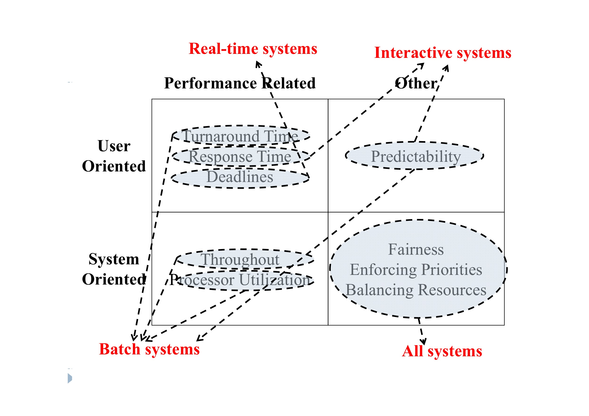

#### 先来先服务(FCFS/FIFO)策略

##### 调度过程

1. 就绪进程加入就绪队列
2. 当前进程停止运行时，在就绪队列最久的进程被运行

##### 周转时间

* 服务时间：进程真正运行的时长
* TAT：在队列内的时间或在系统内的总时间 
  $Turnaround\ Time = Finish\ Time - Arrival\ Time$
* 归一化周转时间： $\frac{Trunaround\ Time}{Service\ Time}$

##### FCFS优缺点

**优点**：

* 简单，容易实现

**缺点**：

* 对长进程表现好，短进程表现差
* 相比I/O密集型，偏爱计算密集型进程

**总结**：

* 最朴素的FCFS对单处理器表现不好
* 结合优先级机制更有效

#### Round-Robin轮转调度

* 旨在减少FCFS对短进程的不友好
* 时间分片机制(**抢占式**)

##### 调度过程

1. 接收外部时钟中断
2. 收到中断就把当前进程加入就绪队列
3. 选择下一个调度

**考调度过程图，TAT计算**！

##### 分析

* **时间片长度**是Round-Robin的关键
  * 短时间片可以多运行短进程
  * 短时间片导致额外的中断处理，调度和dispatch开销
* 对一般的分时/事务系统好用
* 缺点：不公平性
  * 对I/O密集程序不公平：
    * 刚运行一会儿就因I/O重新加入等待队列
    * 程序性能差，对I/O设备利用率差
  * 不同进程响应时间的方差变大

##### 改进：Virtual round robin(VRR)

* 引入一个FCFS辅助队列
  * I/O阻塞的进程在得到I/O事件后加入这个队列
  * 在辅助队列里的进程有dispatch(调度)优先权

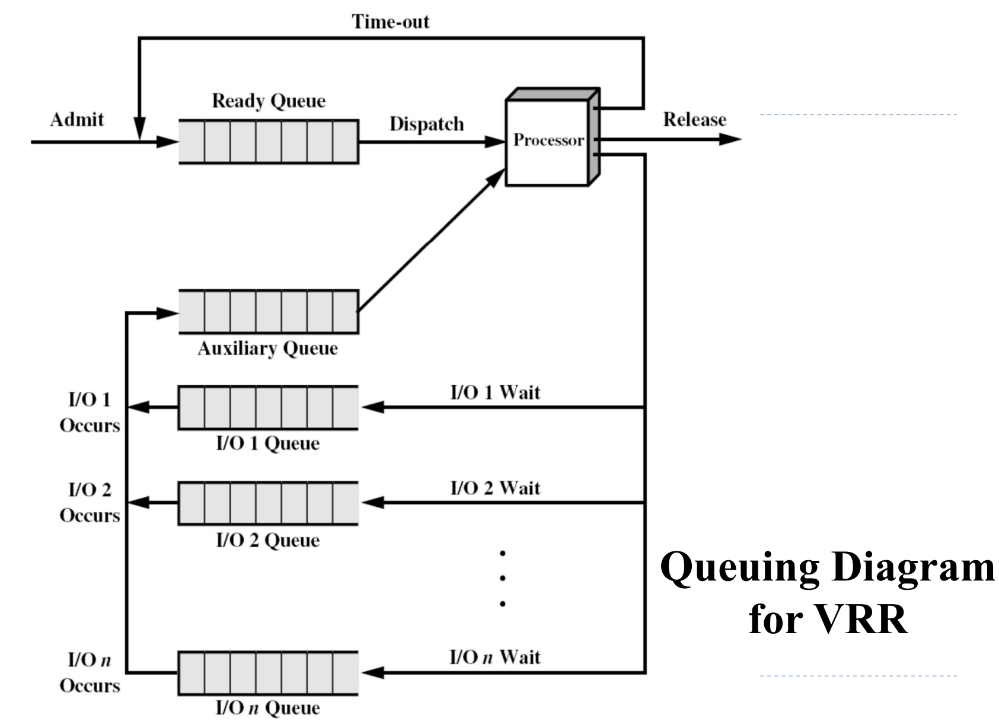

#### Shortest Process Next最短运行时间

* 同样旨在减少FCFS对长进程的偏好
* 是**非抢占式**策略
  * 选择预计运行时间最短的进程

##### 分析

**优点**：

* 相比FCFS，总体性能更好
  * 当所有进程同时进入系统，是最优策略

**要求进程运行时间**：

* 批处理系统中程序员需要估计并提供这个事件
  * 如果估计的时间远小于实际运行时间，进程会被系统终止
* 实际系统中，OS会用运行平均时长

**缺点**：

* 进程不同时进入系统时不是最优的
* 长进程可能有starvation
  * 长进程难以预测完成时间
* 对长进程偏好的改进不够大
  * 原因：不支持**抢占**
* 需要**知道或估计进程运行时间**

#### Shortest Remaining Time最短剩余时间

* SPN的**抢占式**版本
* 相比FCFS，SRT**没有**长进程偏好
* 相比round robin，没有额外中断减少了开销
* 因为短进程及时的偏好，表现比SPN好
* 需要记录已经运行的时间

#### 优先级调度

##### 过程

* 调度优先级最高的进程
* 相同优先级按FCFS顺序调度
* 抢占/非抢占的SPN/SJF是优先级调度的特例

##### 优先级

* 典型优先级：$\frac{1}{Next\ CPU\ burst}$
* 优先级可以被动态/静态分配
  * 为了防止高优先级进程一直运行，可能会在运行时不断降低其优先级
* I/O密集型程序应该有高优先级

##### 抢占性

* 可以是抢占/非抢占的
  * 抢占式：如果新进程优先级更高，就抢占当前进程
  * 非抢占：只会把新进程放进就绪队列

#### Highest Response Ratio Next最高响应比(HRRN)

* 目标：最小化归一的周转时间TAT的平均值
* **非抢占式**，在进程结束或阻塞时选择R最大的进程调度

$R = \frac{w+s}{s},\ where\ R = response\ ratio,\\ w = time\ spent\ waiting\ for\ processor,\ s = expected \ server\ time$

##### 分析

**优点**：

* 考虑了进程的age
* 没有starvation（相比SPN, SRT）
  * 虽然短进程被偏好，但时间长了长进程终究会有高响应

**缺点**：

* 需要估计进程运行时间（和SRT, SPN一样）

#### Multilevel Queue Scheduling多层队列调度

* 有多个就绪队列
* 每个进程被永久归入一个队列
* 每个队列的调度算法不同（例如前台队列是最高RR，后台是FCFS）
* 队列间有调度算法（例如固定优先级的抢占式调度

#### Feedback反馈（多级反馈）

* 解决SPN, SRT, HRRN依赖估计进程运行时间的问题
* 通过penalize运行时间长的进程替代
* 以**已经运行时间**代替**剩余时间**
* 是**时间片抢占式**的，**动态优先级**的

##### 流程

1. 第一次进入系统的进程进入RQ0队列
2. 执行一次后，再进入时为RQ1队列
3. 后面每次进程被抢占，都会被移到更低优先级的队列
4. 每个队列内使用FCFS（除了优先级最低的
5. 优先级最低的使用Round-Robin

##### 分析

* 短进程不会运行几次就会完成，因此不至于被移动到很低的优先级
* 长进程会慢慢被移到低优先级队列
* 因此不会有长进程偏好

##### 改进

* 简单版本在periodic interval(像RoundRobin一样)做抢占
  * 问题：长进程的周转时间可能很长
* 改变：根据队列改变抢占时间
  * ${RQ}_{i}$队列中的进程会执行$2^{i}$次后被强占
* 但长进程依然可能会starvation
  * 将等待太久的进程放入高优先级队列

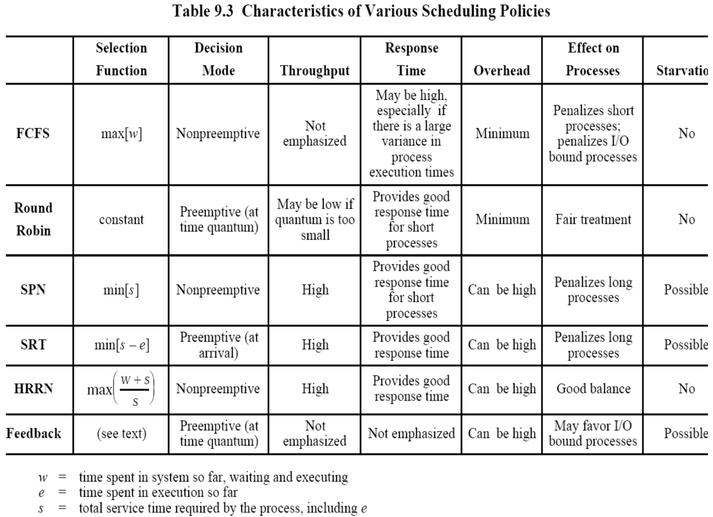

## Chap7-内存管理

1. 单道程序OS
   * 主存只分为OS和程序两块
   * 固定的地址转换，程序引用的物理地址在运行前就被运算完了
2. 多道程序OS
   * 动态地址转换

**内存抽象——地址空间**：

* 没有内存抽象时，进程直接看到物理地址
* 导致进程间容易互相干扰
* 地址空间：一个进程可用的内存地址集合
* 内存管理：等级化的内存，尽可能将多的进程装入内存

### 连续内存分配

#### 内存分区

##### 固定分区

* 可用内存按固定边界分区
* 每个区只能装入一个进程
* 按分区大小是否固定又可分为：
  * Equal-size partition
  * Unequal-size partition

**固定大小的分区问题**：

* 进程可能太大，装不下
  * 程序必须使用overlay
* 难以充分利用主存
  * 不管多大的程序都会占用这个分区
  * 产生**内部碎片**：分区内有没利用到的空间
* 两个问题都能用不固定大小分区解决

###### 放置策略

* 固定大小分区：随便放
* 不等大小分区：
  * 把进程放入能放得进的最小分区
  * 进程队列

###### 优缺点

* 简单开销小
* 但限制了进程总数
* 分区和进程大小差距大时，内存利用效率低

##### 动态分区

* 分区大小数量都可以改变
* 产生**外部碎片**：分区外的主存里有很多small hole

###### Compaction

* 为了解决外部碎片，移动进程在内存中的位置
* 消耗很多CPU time
* 需要动态重定位

###### 分配算法

* Best-fit：找大小最接近的
  * 一般表现最差
  * 留下很多小碎片
  * 更需要compaction
* First-Fit：从头开始扫描内存找第一个
  * 最简单
  * 但往往也最好最快
* Next-fit：离最后一次placement最近
  * 比First-fit稍差
  * 偏好在内存末尾分配
  * 最大的内存块被很快break up
  * 更依赖compaction 

##### 缺点

* 相比固定分区更复杂
* 需要额外的compaction开销

#### Buddy System伙伴系统

* 固定和动态分区间的妥协
* 每个内存块大小为$2^{U}$
* 如果进程大小$s$服从$2^{U-1}<s\leq 2^{U}$那就分配整个块
  * 否则将块分为两个相等的buddy
  * 直到内存中最小的块满足上式

### 分页

* 进程可以使用不连续的物理内存空间
  * 物理内存：frames页框
  * 逻辑内存：pages页面
* 只在最后一个page里有内部碎片，**没有外部碎片**

#### 页表与逻辑地址

* OS为每个进程维护一个page table
  * page table中记录每个page对应的frame
* 逻辑地址由page number和页内offset组成

#### 分页与分区

* 分页下每个内存区更小
* 程序可以占有多个区
* 区不用连续
* 内部碎片很少

### 分段

* 支持用户视图的内存
* 逻辑地址：segment number + offset

#### 分段和动态分区

* 内存段大小都不固定
* 没有内部碎片但有外部碎片
* 分段中进程可以占有大于一个的非连续内存区
* 外部碎片更少

#### 分段和分页

* 分页对用户不可见但分段对用户可见
* 逻辑地址和物理地址不能简单转换
* 使用段表：
  * 段表项记录段号和段内存起始位置的映射关系
  * 记录段长度（避免越界
* 段长度可动态增长
* 对不同段分开保护
* 支持进程间共享段信息
  * 因为段代表的是逻辑信息，而页只代表物理信息

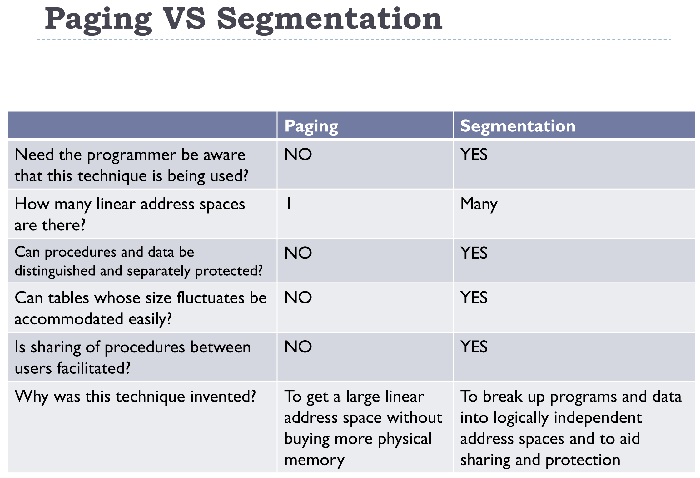

## Chap8-虚拟内存

* 逻辑地址在运行时被动态转换

**Thrashing**：
* 处理器大多数时间都花在swap内存而不是运行程序上
* 在一个page马上被用到前把它换出

### 硬件和控制结构

#### Paging

##### Page Table Entry

* PTE中不包括页不在主存时的disk address

###### 控制位

* Present(P)：页是否在主存中
* Modified(M)：从disk装入后是否修改过
* Referenced(R)：页是否正在被用(Reading, Writing, etc.)
* Protection(R/W或U/S)：访页问权限

##### Page Table Structure

###### 问题：

1. 不能太大
2. 访问要快
3. 放在寄存器中的话虽然访问快，但太贵；进程切换开销太大
4. 放在主存中的话，进程切换方便了；但要访问内存

##### Two-Level Page Table

###### 解决的问题

* 单个页表放在内存太大
* 页表存在虚拟内存中

###### 结构

* 一个Page Directory页目录指向Page Table
* 页目录长度为$X$，页表长度$Y$，则总共可容纳$X \times Y$个pages
* 一个Page Table一般和一个页一样大

###### 问题

* 对64-bit电脑来说不合适
  * 需要6~7级的页表
  * 地址转换时的内存访问开销太大

##### Inverted Page Table

* 解决层级页表面对64位系统的无力
* 只有一个页表
* 以(process, virtual page)的结构对应物理页框
* 每个页框固定只有一个页表项，因此页表大小只与物理页数有关
* 页表表项号就是物理页号
* 通过hash解决遍历表太慢的问题

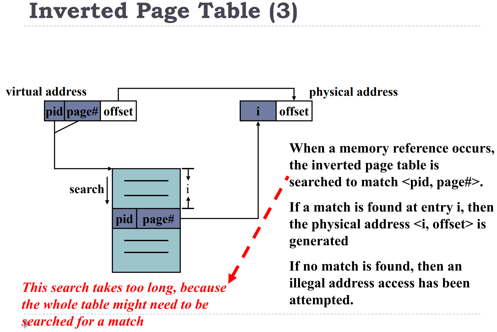

##### Translation Lookaside Buffer

###### 解决的问题

* 每次虚拟内存引用要访问两次内存：
  1. 找页表
  2. 找真实数据
* 通过高速缓存cache TLB替代访问页表，减少内存访问

###### 设计

* 保存最近最常用的页表项
* 进行地址转换过程：
  1. 通过硬件，将虚拟页号和所有页表项**同时比较**（associative mapping）
  2. 如果找到了，那就不用再访问内存
  3. 如果没找到，那就再去页表里找
* 页表项被从TLB移除时，要把modified位写回内存里的页表

**Address-space Identifiers**:

* 部分TLB会保存地址空间标识(ASID)
  * 唯一的标识页表项归属的进程
  * 使得TLB可以同时保存多个进程的PTE
* 如果不支持，那更换页表时就要flushTLB

###### TLB进程切换

* 简单的方法：直接flush整个TLB
* 更高效的策略：
  * 使用Address Space Number
  * 使用Page Global Enable

##### 页大小的设计

###### 相关问题

* 内部碎片：页越小，内部碎片越少
* 页表大小：页越小，页表就越大（页号变多
* 外部内存：外存能高效transfer大的block，因此页越大性能越好
* 局部性：页越小，局部性越好
  * 精准匹配程序局部性
  * 总IO变少
  * 总分配内存变少
* 页错误数：页越大，页错误数越少
* TLB表现：页越大，TLB性能越好

#### Segmentation

##### 优点

* 简化增长的数据结构的处理（堆栈）
* 允许程序被独立的修改/重编译
* 共享和保护

段页结合：

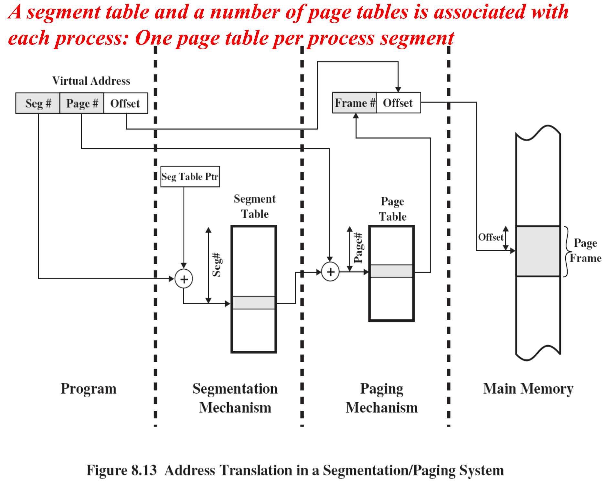

### OS Software

是否使用虚拟内存和分段分页取决于硬件支持

#### Fetch Policy

* 什么时候将页读入主存：
  * 请求式调页
  * 预调页

#### Placement Policy

* 把页放在物理内存的位置

##### NUMA Multiprocessor

* Non-Uniform-Memory-Access(NUMA)非一致存储访问多处理器
  * 访问物理位置的时间和处理器和内存的距离有关

#### Replacement Policy

* 决定主存中要被换出的页

##### Optimal Policy

* 选择**距离下一次使用的时间最久**的页换出
* 是**最佳策略**（页错误次数最少）
* **不可能实现**，因为需要内存访问的先验知识

##### Least Recently Use(LRU)

* 选择**最久没被访问**的页换出
  * 依据：局部性
* 问题：难以实现
  * 需要记录每个页的上次访问时间，开销大

###### 链表实现

* 当一个页被访问，就从链表中移除，放到链表头
* 因此链表尾就是LRU

###### Counter实现

* 每个PTE关联一个上次访问时间项，维护一个系统计时器
  * 每次内存访问clock++
  * 当页被访问，把系统计时器值复制到PTE的time-of-use field

###### Matrix矩阵实现

* 对有$n$个页框的机器，LRU硬件维护$n \times n\ bits$的矩阵
* 每次页框$k$被访问时，就把第$k$行全部置1，第$k$列置零
* 行二进制值最小的就是LRU

##### First-In-First-Out

* 在内存最久的页被换出
* 问题：被换出的页可能马上有会用到
* 适合线性访问segments的进程

##### Belady's Anomaly异态

* 当进程可用的主存变多，性能反而变差（FIFO受影响

###### Stack Algorithms

* 栈算法：分配m页时装入主存的页集合是m+1页时的子集
* 栈算法不受Belady异态影响

#### 额外状态位

* Use bit：页被引用时置1
* Reference bit：每个页8bit byte
* 时钟中断发生时
* OS将Reference bit放在8bit byte的最高位，并右移这个byte
* byte最小的就是LRU

##### Second Chance Algorithm

* 对FIFO的简单改进
* 检查最老的页的Use bit
  * 如果是0，就换出
  * 如果是1，就清除这个位并把它放在列表尾，装入时间设置为刚进入内存

##### Clock Policy

* 一种实现Second Chance算法的方式
* 将候选页框放在一个circular buffer里
* 当换出时，在buffer里找use bit为0的第一个页换出
* 查找换出时，所有use bit被设为0

###### 与FIFO

* 类似但所有use bit为1的页框都会被跳过
* 避免了把经常用的页换出

##### Clock Policy改进

* 增加use bit的位数
* 使用一个use bit和一个modified bit

###### 算法步骤

1. scan buffer找第一个(u = 0, m = 0)的换出
   * 在scan的时候不改变use bit
2. 如果第一步没找到，就再scan一轮找第一个(u = 0, m = 1)的换出
   * 这一轮scan将经过的use bit设为0
3. 如果第二步没找到，就重复第一步第二步。因为此时所有use bit都是0，因此这一轮一定能找到

###### 优点

* 倾向于换出没修改过的页面
* 修改过的页面换出前要被write out

##### 其他基于count的策略

* LFU——Least Frequently Used
  * count最小的被换出
  * 但一些页过去用的多，可能未来不会再用到
* MFU——Most Frequently Used
  * count小的可能是刚读进来的页

##### Page Buffering

* 换出被修改过的页开销大
* 要被换出的页不直接被write out，先被放在free frame pool里
* 让请求页的程序可以马上运行，不用等待页被write out

* 维护了一系列被修改过的页
* 当paging device空闲时就选择并将一个被修改的页写回外存

###### 过程

* 未修改过的页被换出时，它将留在内存里，被加入free page list尾
* 修改过的页被换出时，被write out，替换掉，page frame被加入modified page list尾

###### 优点

* 要换出的页留在内存里
  * 如果进程又要访问，它马上可以被重新加入工作集
  * 修改过的页被一起写回
    * 减少disk access time
  * 修改过的页可以在paging device空闲时被写回

#### Resident Set Management驻留集管理

**决定一个进程在主存里能有多少内存页**！

##### 三大要点

1. 单个进程的内存越少，主存中能驻留的进程就越多
2. 进程主存里的内存越少，越容易页错误
3. 超过一定大小后，给进程分配内存的边际效用就很低了

##### 分配策略

* Fixed Allocation：固定进程最大可被分配的frame数（根据进程类型，请求确定）
* Variable Allocation：进程可被分配的最大页数在其生命期是可变的
* Local Scope：只能用自己驻留集里的其他页替换
* Global Scope：可以用任何free page

#### Working Set Strategy工作集策略

##### 定义

* **Working Set：The set of pages that a process is currently using，进程正在使用的一系列内存页**
* working set $w(\Delta, t)$：在任意时间$t$，进程最近$\Delta$次page reference内被引用过的内存页集合
* 只有working set在主存中（在驻留集）进程才能工作

##### Page Fault Frequency Algorithm缺页频率PFF

###### PFF的意义

* PFF高：进程运行低效，应该增加驻留集
* PFF低：增加页的边际效用很低，应该释放一些页

###### 算法步骤

* 每个frame一个use bit，被访问时置1
* 当页错误发生，OS检测距离上次页错误发生的时间：
  * 如果大于一个先验阈值$F$，就给进程驻留集增加一个页
  * 否则丢弃所有use bit为0的页，相应的缩小驻留集，将所有页的use bit置零

###### 缺点

* 在短时间shift to a new locality（局部性过渡）时表现不好
* 会产生大量page fault，驻留集膨胀
* 在经过阈值$F$的时间之前，没有页会被抛弃
* 造成突然的大量内存需求->进程不断被deactivation，reactivation->大量context switch，swapping

##### Variable-Interval Sampled Working Set采样间隔可变工作集(VSWS)

* 解决局部性过渡问题
* 在采样时间evaluate工作集
* 参数：
  * $M$：采样间隔最小值
  * $L$：采样间隔最大值
  * $Q$：允许两个sampling instance之间发生的页错误数量

###### 算法步骤

**一个Sampling Interval内**：

1. sampling interval开始时将所有驻留集页的use bit置零
2. 结束时，将所有期间被引用过的页use bit置1
3. 驻留集size在interval结束时缩小
4. 在interval中间驻留集不变或变大

**每隔一个采样间隔的采样instance内**：

1. 如果时间距上次sampling instance为L（最大）时，挂起进程检查use bits
2. 如果在时间到L之前发生了Q次页错误：
   * 如果时间小于M，那等时间到M再挂起进程检查use bit
   * 否则就直接挂起进程检查use bit

###### 效果

* 减少峰值内存需求的方式：
  * PFF增加时增加采样频率，进而增加了被丢出驻留集的unused page

##### Cleaning Policy清除策略

* 决定修改过的页被写回外存的时间
* 请求式清除（当页被换出时）
  * 最小化write
* 预清除：可以成批的写出

###### 使用Page Buffering

##### Load Control负载控制

**决定内存中能驻留的进程数量**!

* 进程太少：可能所有进程没事干，都等着swapping
* 进程太多：平均驻留集不够大，系统陷入thrashing（频繁页错误）

###### Thrashing（抖动/颠簸）

* 进程的大多数时间花在paging而不是executing上
* 在马上要用到一个页之前刚刚把它swap出去

* 解决方法

## Chap11-I/O管理和磁盘调度

### I/O类别

#### Programmed I/O

* I/O使用Polling和busy waiting
* 控制寄存器有可以检测的状态位表示I/O是否完成
* 不断地检测状态寄存器浪费了CPU周期

#### Interrupt-Driven I/O

* 提供I/O硬件中断
* 避免不断check状态
* 完成时自动通知CPU

#### I/O Using DMA

* 将I/O工作交给DMA控制器
* 避免每个character都要中断
* 但DMA控制器比CPU慢
  * 如果CPU不忙，那使用前两种I/O更好

### I/O软件架构

4层：用户程序->设备独立软件->设备驱动->中断处理程序

#### Interrupt Handlers

* driver发起I/O请求时会将自己block
* 当收到设备中断，中断处理程序会启动，并unblock driver

#### Device Driver

* 针对特定I/O设备的驱动
  * 向I/O设备发出一系列指令
* 一般来说，为了访问硬件，驱动程序是OS kernel的一部分

##### 驱动的工作流程

* 检查输入参数合法性
* 检查设备是否能使用
* 向设备发起指令
* 可能会将自己block等待I/O完成

#### Device-Independent I/O Software

* 完成所有I/O设备共有的操作（如buffering, allocating）
* 为用户程序提供统一的interface
* Naming, blocking, buffering, allocating

##### I/O保护

* 防止用户发起非法I/O请求干扰系统
* 所有I/O指令都是特权级的
* 所有MMI/O内存用户都不能访问

#### User-Space I/O Software

* 运行时库
  * 间接调用系统调用
  * formatting
* Spooling：I/O设备虚拟化

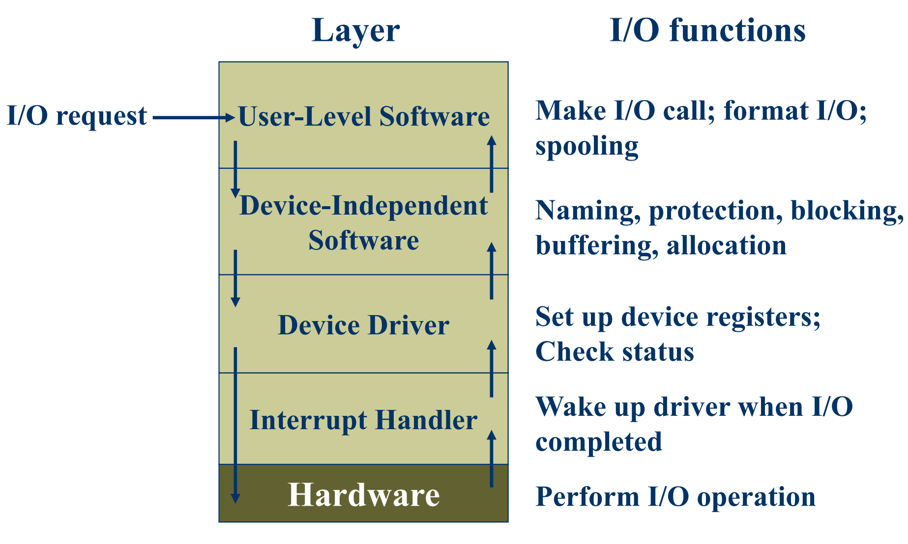

### I/O Buffering

* 解决CPU速度和I/O设备速度不配的问题

#### 单缓冲区

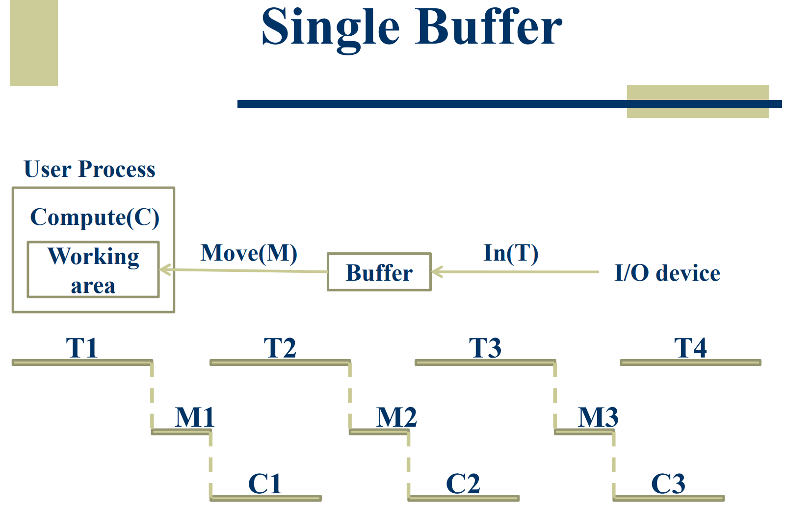

* 单独一块缓冲区
* 将每个block的耗时从$T+C$减少到$max(T, C)+M$

#### 双缓冲区

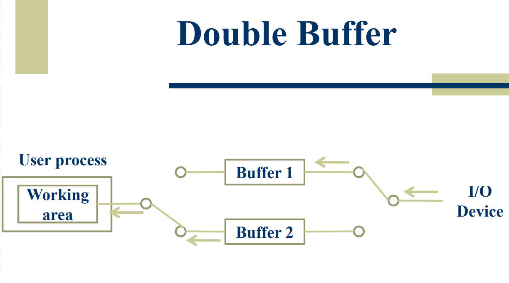

* 耗时减少到$max(T, C)$

#### 循环缓冲区

* 多于2个缓冲区
* 生产者消费者模型
  
#### Buffering：总结

* 让IO更smooth，匹配CPU与IO设备速度
* 多少还是会有额外IO开销

##### Buffer和Cache

* Cache：
  * 相同数据会被从Cache中多次读取
  * 刚写的数据会马上被读
* Buffer：压平峰值IO需求

### 磁盘

#### 性能参数

* $Seek\ time$(寻道时间)：磁头移动到track的时间
* $Rotational\ latency$(旋转延迟)：sector头转到磁头位置的时间
* $Access\ time$(访问时间)：$Seek\ time+Rotational\ latency$
* $Transfer\ time$()：$\frac{b}{r\times N}$，b是要运输的总数据量(byte)，r是转速(转/分钟)，N是一个track上的总字节数
* 平均访问时间:
$T_{a} = T_{s} + \frac{1}{2r} + \frac{b}{rN}$
寻道时间+旋转延迟+传输时延

#### 磁盘调度

* 寻道时间是性能差异的主要原因
* 系统维护一个IO请求队列

##### FIFO

* 按I/O请求队列的先后顺序处理
* 对所有进程公平
* 进程多时相当于随机
* 只有进程少，访问集中时有比较好的性能

##### Priority

* 目标不是最优磁盘利用
* 短任务有高优先级
* 交互响应时间好

##### Shortest Service Time First

* SSTF选择让磁盘臂从当前位置移动最少的请求
* 即Seek time最短的请求
* 不保证平均寻道时间最小

##### SCAN

* 磁盘臂只单方向移动直到这个方向的最后一个track或没有请求
* 来回循环往复

##### C-SCAN(circular scan)

* 只允许一个方向的scan
* 返回另一端时不scan
* 减少新请求的等待时间

##### N-Step-SCAN

* 解决磁头臂粘性：部分进程一直在一个track读取
* 将请求队列划分为长度为N的子队列
* 每个队列内部用SCAN处理
* 一个请求队列在处理时，新请求被加入其他队列
* N很大时相当于SCAN
* N等于1时相当于FIFO

##### FSCAN

* 两个队列
* scan开始时所有请求在一个队列，另一个空
* scan时所有心情求被放在另一个队列

## Chap12-文件系统

### 文件目录

#### 文件目录结构

##### Single-Level Directory

* 一个文件entry的列表
* 没办法grouping
* 文件命名不能重复

##### Two-Livel Directory

* 每个用户一个目录
  * 记录这个用户文件的list
* 另有一个master目录
  * 记录每个用户的entry，提供地址和访问控制信息

**优点**：

* 将用户分隔了

**缺点**：

* 每个用户内文件名要相同
* 对结构化collect文件没有帮助
* 难以访问其他用户的文件

##### Tree-Structured Directory

* 树任意高度
* 每个目录下可以是文件也可以是目录
* 对用户结构化组织文件有帮助：每个用户能任意创建文件和子目录
* 文件可以被pathname定位，因此不同目录下可以有相同文件名

###### Path Name

* current directory/working directory：当前用户在使用的文件夹，包括大多数在用的文件
* 绝对路径：从根目录开始，是独一无二的
* 相对路径：从working directory开始

##### Acyclic-Graph Directory无环图目录

###### 文件共享

* 多个用户在一个项目上工作时，最方便的是让一个文件同时在不同用户目录下出现
* 无环图使得文件目录可以有共同子目录

##### 硬链接

* 将A要共享的文件相关的directory entry直接复制到B的文件目录里
  * 问题1：如果entry里有文件数据块的地址怎么办
  * 如果A删除了这个文件怎么办
* 解决：
  * 不在文件目录里保存disk block，而在inode里
  * 文件目录直接指向inode
  * inode里有link-count项

* 硬链接中文件的磁盘地址不应该在directory entry里
  * 否则连接后B就应该在自己的文件目录里页加上这个地址
  * 而如果A,B中一人append了文件，那新增的block就只会呈现在修改者的文件目录，对另一个人不可见
* 因此disk block应该在文件自己的inode里

##### 符号链接

* OS在B的目录下创建一个类型为LINK的文件
  * 这个新文件里只包含要连接的A文件的路径名
  * 当B读取这个文件，OS发现这是LINK类型文件，会自动从指向的目录读取真正的文件
* 只有真正的拥有者有指向文件inode的pointer
  * 文件拥有者删除文件后，链接者不能通过符号链接访问
  * 链接者删除链接则没有影响

**问题**：

* 读取符号链接后需要再访问真正的目录找到inode，造成额外磁盘access开销
* 符号链接文件也需要一个额外的inode和一个disk block存储路径，造成了存储开销

**优点**：

* 可以链接任何地方的文件

### 文件保护

#### 访问控制

##### 域

* 每个对象都有一定可以进行的操作，可以组合成(Object, Operation)形式
* 这种对组合成的集合就是域

```
UserA's Domain{
    (File1, (Read, Write))
    (File2, (Read))
    (File3, (Read, Write, Execute))
}
```

###### Access Control List存取控制列表

* 存储每个object接收User的访问情况
* 问题：长度太长，要可变长
* 解决：用三个用户分类代替
  * Owner
  * WorkGroup：共享文件的
  * Universe

###### Capability权能

* 存储每个User(Process)能访问的object情况

### 组块记录

#### Fixed Blocking

* 使用固定长度的record
* 有内部碎片
* 对sequential file常用

#### Variable Blocking: Spanned

* 使用不同长度的record
* 没有内部碎片
* record可以跨越block
* 存储效率高，但难以实现：
  * 跨block需要两个IO操作
  * 文件难以update

#### Variable Blocking: Unspanned

* 使用不同长度的record
* record不能跨越block
* 有内部碎片
* 浪费了空间，record被限制了长度

### 二级存储管理

#### File Allocation

##### Contiguous Allocation

* 文件创建时分配连续的一系列block
  * file allocation table中只需要一个表项
* 是预分配的，使用变长protion
* 常用在CD-ROM

###### 优缺点

**优点**:

* 连续分配的文件访问非常容易
* 磁盘只需一次seek time
* 读单个block容易（类似数组线性访问

**缺点**：

* 外部碎片
  * 需要compaction去释放磁盘空间
* 文件大小声明问题
  * 必须要在创建时声明大小
* 即使预先知道大小，预分配也是低效的
  * 文件在很长时间内可能长度缓慢增长


##### Chained Allocation

* 分配以单个block为单位
  * 每个block有指向下个block的指针
* 同样只需要分配表中一个表项
* 没有外部碎片，没有大小声明问题
* 适合线性访问

**缺点**：

* 1. 只对线性访问高效
  * 读取第i个block需要从头开始
  * 每个pointer读取都要磁盘访问
* 因此支持direct access很低效
* 2. 需要合并
  * block分散，需要多次磁盘访问
* 3. 指针也占用磁盘空间
  * 解决方案：将block聚集成cluster
* 4. 可靠性不足（指针损坏时

##### FAT: File Allocation Table

* 每个分区开头的一个section保存分配表
* 分区表内是链表形式
* 分区表内每个表项号对应实际磁盘块号
* 每个表项存储下一个表项的index，末尾块是特殊的EOF标志

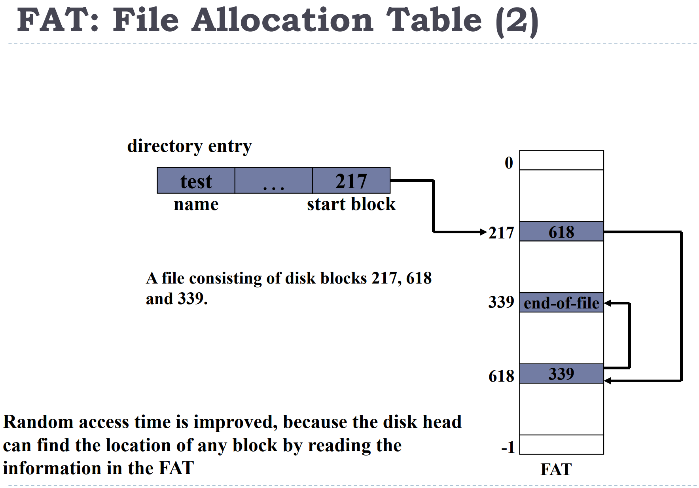

* 如果没cache，那访问fat本身也会造成额外的磁盘访问开销
* 提升了随机访问性能

##### FAT: Indexed

* 解决direct access性能问题
* 引入index block
* FAT表中存储每个文件的一级索引
* 比chained的pointer开销小

**固定长度按block分配**：
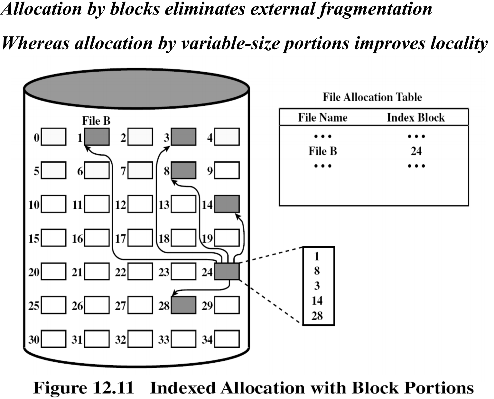

**可变长度分配**：
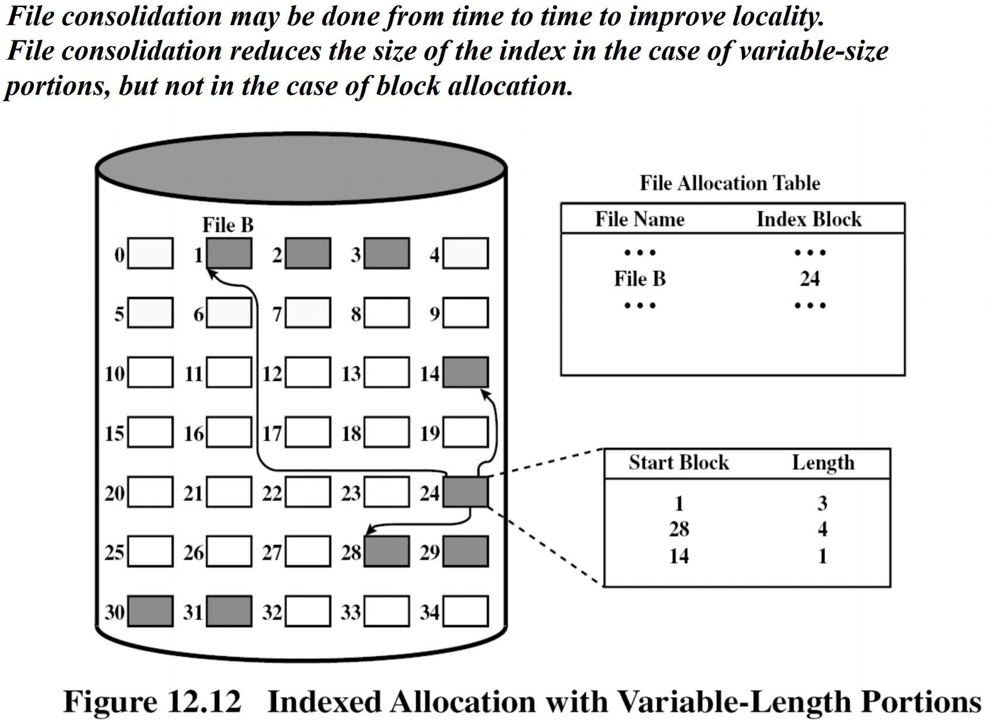

### UNIX文件系统


